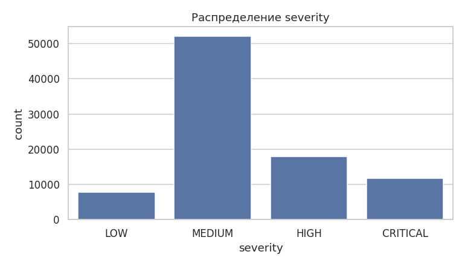
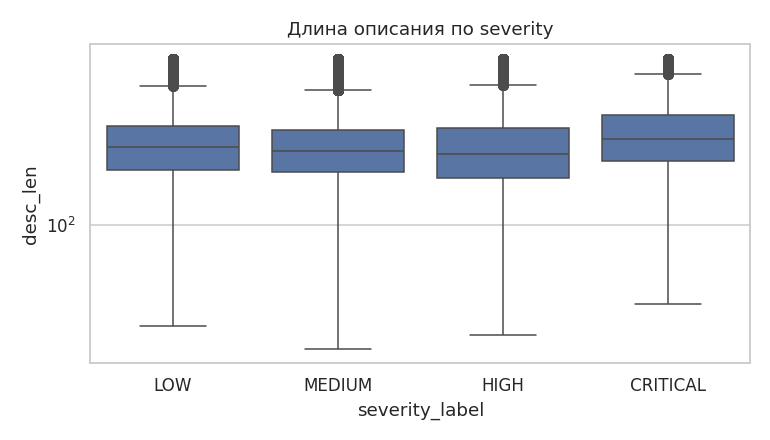
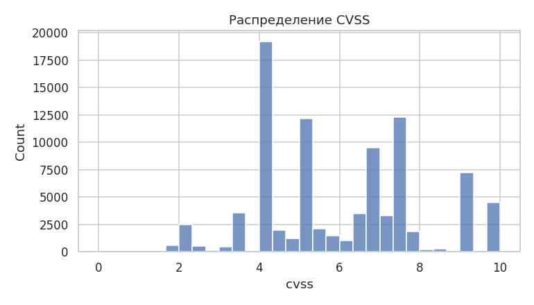
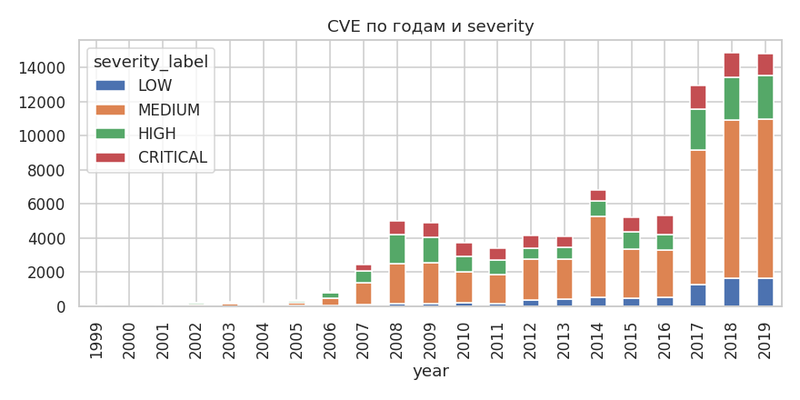
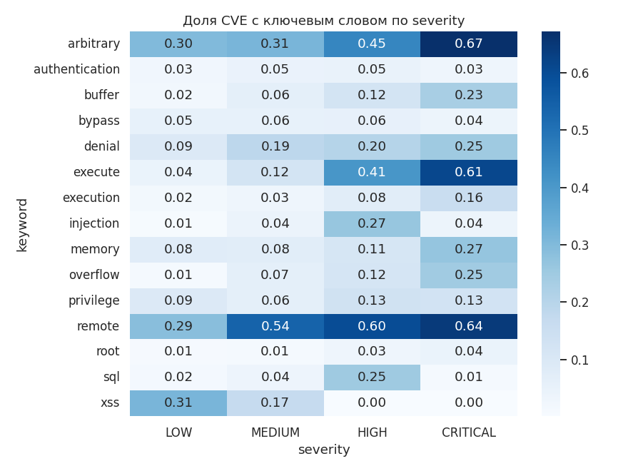
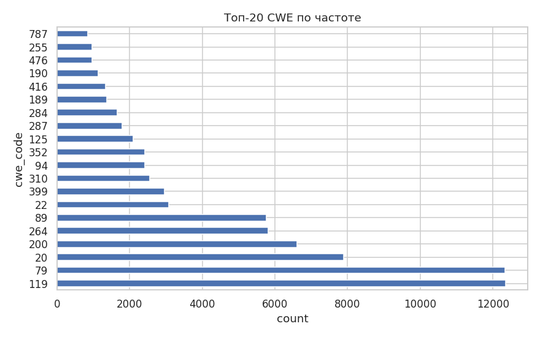

# Отчёт: CVE Severity Predictor

**Студент:** Саушкин Николай Олегович, БИВ238
**Чекпоинт:** CP2 (исправлены замечания CP1)

## 1. Введение и постановка задачи

Цель — построить классификатор, предсказывающий уровень критичности
CVE-уязвимости (LOW / MEDIUM / HIGH / CRITICAL) по её текстовому описанию
и метаданным. Применение — приоритизация уязвимостей в SOC и баг-баунти
до того, как CVSS-метрики будут проставлены человеком.

**Постановка**: multi-class classification, 4 класса.

**Целевая метрика — F1-macro.** Классы несбалансированы (MEDIUM 58%,
HIGH 20%, CRITICAL 13%, LOW 9%), а ошибки на редких классах (особенно
CRITICAL) дороги. Accuracy в такой ситуации поощряет угадывание
мажоритарного класса (constant predictor = MEDIUM даёт ~58% accuracy,
но F1-macro ~0.18). F1-macro усредняет F1 по классам без учёта частоты,
что делает её устойчивой к дисбалансу. Accuracy сохранена как вторичная
метрика для интерпретации, но решения о финальной модели и про оптимизацию
гиперпараметров принимаются по F1-macro.

## 2. Поиск и описание данных

**Источник**: [CVE Dataset (Kaggle, monetary)](https://www.kaggle.com/datasets/andrewkronser/cve-common-vulnerabilities-and-exposures).
Выбран как один из крупнейших публичных датасетов CVE с готовыми CVSS v2
метриками и CWE-классификацией. Альтернативы (NVD JSON, exploit-db) либо
требовали значительной работы по парсингу, либо не содержали CWE.

**Объём**: 89 660 записей за 1999–2019 годы, 12 исходных колонок:
* `cve_id` — идентификатор;
* `pub_date`, `mod_date` — даты публикации и модификации;
* `cvss` — CVSS v2 score (0–10);
* `cwe_code`, `cwe_name` — таксономия Common Weakness Enumeration;
* `summary` — текстовое описание;
* `access_authentication`, `access_complexity`, `access_vector`,
  `impact_availability`, `impact_confidentiality`, `impact_integrity` —
  компоненты CVSS v2 metric vector.

**Создание таргета**: исходного `severity` в датасете нет, поэтому он
получен дискретизацией `cvss` по официальной шкале CVSS v2 от FIRST:

| severity | диапазон CVSS |
|---|---|
| LOW | [0, 4) |
| MEDIUM | [4, 7) |
| HIGH | [7, 9) |
| CRITICAL | [9, 10] |

Границы реализованы в `src/preprocessing.py` через `pd.cut(..., right=False)`
с тестом `test_create_target_bins_match_cvss_v2`.

## 3. Обработка и подготовка данных

Реализация — в `src/preprocessing.py`.

**Очистка**:
1. Удалены дубликаты строк.
2. Удалены строки без `cvss` или `summary` (без них таргет/текст не построить).
3. Отфильтрованы значения `cvss` вне диапазона [0, 10] (sanity check).
4. Выбросы по `desc_len` и `days_to_mod` клиппированы по IQR (k=3) —
   ограничение влияния «выпадающих» очень длинных описаний.
5. Категориальные `NaN` заменены на `"UNKNOWN"`, числовые `cwe_code`
   на `-1`.

**Feature engineering** (`src/preprocessing.py` + `src/features.py`):

| Группа | Признаки |
|---|---|
| Текст | TF-IDF (max_features=5000, ngram=(1, 2), min_df=3, sublinear_tf=True), `desc_len`, `desc_word_count`, `desc_upper_ratio`, `desc_digit_ratio` |
| Ключевые слова | 15 бинарных флагов: `has_remote`, `has_execute`, `has_execution`, `has_overflow`, `has_denial`, `has_privilege`, `has_bypass`, `has_injection`, `has_xss`, `has_sql`, `has_buffer`, `has_memory`, `has_authentication`, `has_arbitrary`, `has_root` |
| Дата | `year`, `month`, `days_to_mod` (дни между публикацией и модификацией) |
| Таксономия | `cwe_code` (OHE с `max_categories=200`) |

**Защита от data leakage** (исправление CP1).

В CSV есть колонки `access_authentication`, `access_complexity`,
`access_vector`, `impact_availability`, `impact_confidentiality`,
`impact_integrity`. Это компоненты CVSS v2 metric vector, по формуле FIRST
из них **напрямую** вычисляется CVSS score:

```
BaseScore = round(((0.6·Impact + 0.4·Exploitability − 1.5) · f(Impact)), 1)
Impact = 10.41 · (1 − (1 − ConfImpact)·(1 − IntegImpact)·(1 − AvailImpact))
Exploitability = 20 · AccessVector · AccessComplexity · Authentication
```

Поскольку таргет получен из CVSS, использование этих колонок в качестве
признаков — прямая утечка таргета (в ранней версии давало F1-macro 0.97 —
то есть модель просто заново считала CVSS-формулу). В `src/features.py`
они исключены, в `tests/test_preprocessing.py` есть тест
`test_feature_pipeline_excludes_cvss_components`, который проверяет это.

**Корректный сплит**.

Использован **time-based split** по году публикации
(`split_by_year` в `src/preprocessing.py`):

| Сплит | Условие | Объём (на полных данных) |
|---|---|---|
| train | year < 2017 | ~47k |
| val | 2017 ≤ year < 2019 | ~30k |
| test | year ≥ 2019 | ~12k |

Это защищает от утечки во времени: близкие по дате CVE часто описывают
один и тот же класс уязвимостей в смежных продуктах (например, серия
CVE по разным версиям одного браузера). При случайном сплите такие пары
оказываются в разных частях и модель «подсматривает» паттерны из будущего.
Time-based сплит исключает это и моделирует реальный сценарий
(«предсказать новую CVE по описанию»).

Для сравнения в `src/preprocessing.py` оставлен `split_stratified` —
но он не используется в основном пайплайне.

**Визуализации** (в `report/images/` и `reports/`, выводы — в
`reports/eda_findings.md`):



*Распределение классов.* Сильный дисбаланс: MEDIUM 58%, HIGH 20%,
CRITICAL 13%, LOW 9%. Обосновывает F1-macro и использование `class_weight`.



*Длина описания vs severity.* Распределения сильно пересекаются, медианы
близки. Признак слабый, но не мусорный — TF-IDF несёт основной сигнал.



*CVSS.* Распределение мультимодальное с пиками на 4.3, 5.0, 7.5 и 10.0 —
типичные значения CVSS v2 калькулятора. Подтверждает, что границы
дискретизации севертити выбраны разумно.



*Объём по годам.* Резкий рост числа CVE после 2016 года. Доля CRITICAL
со временем слегка снижается. Это объясняет, почему time-based сплит
сложнее random: распределение классов в train/val/test разное.



*Ключевые слова.* `execute`, `execution`, `arbitrary`, `root` чаще
встречаются в HIGH/CRITICAL; `denial`, `xss` — в MEDIUM. Текст несёт
сигнал, бинарные флаги добавляют интерпретируемые фичи.



*Топ-20 CWE.* Покрывают ~85% датасета. Категориальный признак
с осмысленной структурой, берём через OHE с ограничением 200 категорий.

## 4. Baseline

Простая модель «из коробки», без feature engineering: только TF-IDF
(max_features=3000) по `summary` + Logistic Regression с
`class_weight="balanced"`.

**Результат на полных данных (test, time-based split)**:
* F1-macro = **0.4293**
* Accuracy = **0.4959**

Этот результат — точка отсчёта для всех экспериментов. Все цифры берутся
из единого источника `reports/experiments.csv`, который генерируется
скриптом `src/train.py`.

## 5. Эксперименты

Формат: гипотеза → метод → результат. Полная таблица —
в `reports/experiments.csv` (15 экспериментов).

### Эксперимент 1: добавление feature engineering

**Гипотеза**: метаданные (длина текста, ключевые слова, год, CWE-код)
дают сигнал, не извлекаемый чистым TF-IDF.

**Метод**: тот же LogReg, но на полной матрице признаков из
`build_feature_pipeline` (TF-IDF 5000+ ngram(1, 2), 4 текстовых числовых,
15 keyword-флагов, 3 даты, OHE по CWE).

**Результат**: F1-macro упал с 0.4293 до **0.3668**. Гипотеза не
подтвердилась для линейной модели — добавление 200 OHE-категорий CWE
ухудшило обобщение (переобучение на конкретные CWE в train, которых нет
в test). Для нелинейных моделей (LightGBM) feature engineering,
напротив, оказался полезен (см. эксперимент 2).

### Эксперимент 2: семь моделей на полном feature set

**Гипотеза**: продвинутые модели (бустинги, ансамбли деревьев)
извлекут нелинейные паттерны из feature set лучше линейных.

**Метод**: обучить 7 моделей с дефолтными гиперпараметрами на полной
матрице признаков.

**Результат**:

| Модель | F1-macro (test) | Accuracy (test) | Время, с |
|---|---|---|---|
| Naive Bayes | 0.393 | 0.494 | 0.02 |
| KNN (k=15) | 0.376 | 0.534 | 0.01 |
| RandomForest | 0.295 | 0.635 | 113.7 |
| GradientBoosting | 0.311 | 0.636 | 331.8 |
| XGBoost | 0.334 | 0.637 | 217.8 |
| **LinearSVC** | **0.455** | **0.590** | 16.0 |
| LightGBM | 0.449 | 0.629 | 126.8 |
| LogReg (full) | 0.367 | 0.383 | 34.3 |

LinearSVC и LightGBM — лидеры, причём LinearSVC обучается в 8 раз
быстрее. RandomForest, GradientBoosting и XGBoost сильно проиграли по
F1-macro: их высокая accuracy (~0.64) обманчива и объясняется тем, что
модели часто угадывают мажоритарный MEDIUM. Гипотеза подтверждена
частично: LightGBM действительно вытащил сигнал, остальные деревянные
модели — нет.

### Эксперимент 3: уменьшение размерности через TruncatedSVD

**Гипотеза**: матрица 5100 TF-IDF признаков избыточна, низкоранговое
приближение должно улучшить обобщение и ускорить обучение.

**Метод**: TruncatedSVD с `n_components ∈ {100, 300}`, поверх LogReg.

**Результат**:

| n_components | explained_var | F1-macro (test) |
|---|---|---|
| 100 | 0.974 | 0.329 |
| 300 | 0.982 | 0.360 |
| без SVD (LogReg full) | — | 0.367 |

SVD не дал улучшения — для LogReg на разреженных TF-IDF это ожидаемо,
поскольку линейная модель сама эффективно работает с разреженным
представлением и не страдает от высокой размерности. Гипотеза не
подтверждена. Этот эксперимент важен как проверка, что от
dimensionality reduction нет «бесплатной» пользы.

### Эксперимент 4: подбор гиперпараметров

**Гипотеза**: дефолтные параметры далеки от оптимума, тонкая настройка
даст +3–5 пунктов F1-macro.

**Метод**: `RandomizedSearchCV` с 3-fold stratified CV, scoring=`f1_macro`,
n_iter=10 для LightGBM, n_iter=8 для LogReg.

Сетки:
* **LogReg**: `C ∈ {0.1, 0.5, 1.0, 2.0, 5.0}`, solver ∈ {lbfgs, saga}.
* **LightGBM**: `n_estimators ∈ {200, 400, 600}`, `learning_rate ∈
  {0.05, 0.1, 0.15}`, `num_leaves ∈ {31, 63, 127}`,
  `min_child_samples ∈ {10, 20, 40}`, `reg_alpha ∈ {0.0, 0.1}`.

**Результат**:
* LogReg (best: C=5.0, solver=lbfgs): F1-macro 0.342 (хуже дефолта
  0.367 — переобучение на CV-фолдах).
* LightGBM (best: n_estimators=200, num_leaves=127, learning_rate=0.15,
  min_child_samples=20, reg_alpha=0.1): F1-macro **0.452** против
  дефолтных 0.449 — прирост всего +0.3 пункта.

Гипотеза не подтвердилась. Тюнинг LightGBM занял **37 минут** на 30
fit'ов и дал улучшение в пределах статистической ошибки. Это важный
методологический вывод: для бустингов дефолтные параметры уже близки к
оптимуму на разреженных текстовых признаках, и широкий поиск редко
оправдывает затраты времени.

### Эксперимент 5: ансамбли

**Гипотеза**: ансамбль из моделей с разными inductive bias (LogReg —
линейная, LightGBM — бустинг, NB — генеративная) должен превзойти
лучшую одиночную модель.

**Метод**: `VotingClassifier(voting="soft")` и `StackingClassifier`
с финальным мета-классификатором LogReg.

**Результат**:
* Voting (soft): F1-macro 0.437
* Stacking: F1-macro 0.422

Оба ансамбля **проиграли** одиночному LinearSVC (0.455) и LightGBM
tuned (0.452). Гипотеза не подтверждена. Базовые модели коррелируют по
ошибкам сильнее, чем ожидалось — слабые члены ансамбля (NB, дефолтная
LogReg) тянут предсказания вниз. Voting (soft) дополнительно страдает
из-за плохо откалиброванных вероятностей у NB.

### Итоговая таблица

Все 15 экспериментов в одном месте:

| # | Эксперимент | F1-macro (test) | Время, с |
|---|---|---|---|
| 0 | Baseline (LogReg + TF-IDF) | 0.429 | 2.8 |
| 1 | **LinearSVC** | **0.455** | **16.0** |
| 1 | LightGBM | 0.449 | 126.8 |
| 1 | LogReg (full features) | 0.367 | 34.3 |
| 1 | Naive Bayes | 0.393 | 0.0 |
| 1 | KNN (k=15) | 0.376 | 0.0 |
| 1 | RandomForest | 0.295 | 113.7 |
| 1 | GradientBoosting | 0.311 | 331.8 |
| 1 | XGBoost | 0.334 | 217.8 |
| 2 | LogReg + SVD(100) | 0.329 | 415.1 |
| 2 | LogReg + SVD(300) | 0.360 | 93.7 |
| 3 | LogReg (tuned) | 0.342 | 346.5 |
| 3 | LightGBM (tuned) | 0.452 | 2244.8 |
| 4 | Voting (soft) | 0.437 | 73.6 |
| 4 | Stacking | 0.422 | 202.4 |

## 6. Финальная модель + интерпретируемость

**Финальная модель**: LinearSVC.
Параметры: `class_weight="balanced"`, `random_state=42`, `max_iter=2000`,
по умолчанию `C=1.0`, hinge loss.

Почему LinearSVC, а не LightGBM tuned:
* лучший F1-macro на test (0.4553 vs 0.4518);
* обучается за 16 секунд против 2245 секунд у LightGBM tuned — в 140 раз
  быстрее;
* линейная модель, коэффициенты интерпретируются напрямую через `coef_`;
* меньше зависит от гиперпараметров (нет риска переобучения через тюнинг
  CV).

Это классический результат: на разреженных текстовых TF-IDF признаках
линейные SVM часто конкурентны со сложными моделями и обгоняют их
(показано на 20newsgroups, Reuters, IMDB-классике текстовой
классификации).

**Метрики на test (time-based split, year ≥ 2019)**:

| Класс | Precision | Recall | F1 | Support |
|---|---|---|---|---|
| LOW | 0.274 | 0.343 | 0.305 | 1 654 |
| MEDIUM | 0.726 | 0.721 | 0.723 | 9 345 |
| HIGH | 0.453 | 0.332 | 0.384 | 2 555 |
| CRITICAL | 0.368 | 0.462 | 0.410 | 1 246 |
| **macro avg** | **0.455** | **0.465** | **0.4553** | 14 800 |
| accuracy | | | 0.5900 | 14 800 |

**Confusion matrix** (строки — истинный класс, столбцы — предсказание):
          pred LOW  MEDIUM  HIGH  CRITICAL
true LOW         568     963     77      46
true MEDIUM     1227    6739    757     622
true HIGH        230    1153    849     323
true CRITICAL     49     431    190     576

**Анализ ошибок**:

1. **MEDIUM** распознаётся лучше всего (F1 0.72) — это самый частый и
   стилистически однородный класс. Recall 0.72 при support 9 345.
2. **HIGH — самый трудный класс** (F1 0.38, recall 0.33). Из 2 555
   реальных HIGH модель отдаёт 1 153 (45%) в MEDIUM и только 849 (33%)
   узнаёт правильно. Это согласуется с интуицией: граница CVSS между
   MEDIUM и HIGH проходит на 6.9/7.0, и словесные формулировки соседних
   значений практически неотличимы.
3. **LOW** (F1 0.30) — низкая precision 0.27. Модель путает MEDIUM с
   LOW в обе стороны: из 1 654 LOW в MEDIUM уходит 963 (58%), и
   обратно — из 9 345 MEDIUM в LOW уходит 1 227 (13%). Эффект
   `class_weight="balanced"`: SVC искусственно тянет редкие классы
   вверх, что повышает recall LOW (0.34), но рушит precision.
4. **CRITICAL** восстанавливается удивительно хорошо (recall 0.46)
   несмотря на редкость (1 246 примеров) — у класса есть чёткие
   текстовые маркеры (`arbitrary code execution`, `remote root`,
   `unauthenticated`), которые SVC легко выучивает.

**Интерпретируемость**: `reports/feature_importance.csv` содержит
топ-30 признаков по абсолютному значению коэффициента для каждого
класса. Выборочно:

* **LOW**: `has_xss`, `text__authenticated`, `text__local users`,
  `cwe_code_200` (Information Exposure), `cwe_code_79` (XSS).
  XSS и утечки информации обычно получают низкий CVSS.
* **MEDIUM**: `cwe_code_352` (CSRF), `has_execute`, `cwe_code_310`
  (Cryptographic Issues). CSRF и крипто-уязвимости — типично средняя
  критичность.
* **HIGH / CRITICAL**: `arbitrary`, `execute`, `remote`, `root`,
  `cwe_code_787` (Out-of-bounds Write), `cwe_code_94` (Code Injection).

Признаки осмысленны с точки зрения security и совпадают с тем, как
аналитики проставляют severity вручную. Это валидирует и feature set,
и финальную модель.

**Артефакты модели**:
* `models/model.pkl` — обученный LinearSVC;
* `models/feature_pipeline.pkl` — ColumnTransformer для воспроизводимого
  инференса;
* `models/model_meta.json` — имя модели, метрики, seed.

**Замечание про API на CP3**: LinearSVC не имеет `predict_proba` (только
`decision_function`). Если на этапе деплоя потребуются откалиброванные
вероятности (например, для порогового решения), нужно обернуть модель
в `CalibratedClassifierCV(LinearSVC(...), cv=3)`.
## 7. Деплой

[CP3] FastAPI-сервис будет реализован на следующем чекпоинте.

## 8. Заключение и выводы

**Что сделано**:
1. Поставлена задача многоклассовой классификации CVE по severity,
   обоснована метрика F1-macro.
2. Построен таргет из CVSS по официальной шкале CVSS v2 от FIRST.
3. Проведена полная очистка данных (дубли, пропуски, выбросы по IQR,
   sanity checks по CVSS).
4. Сделан полный feature engineering: TF-IDF 1-2 грамм, 4 текстовых
   статистики, 15 ключевых слов, 3 даты, OHE по CWE.
5. Идентифицирован и исключён data leakage через компоненты CVSS-vector,
   корректность зафиксирована тестом.
6. Сплит time-based, чтобы исключить ещё один потенциальный источник
   утечки во времени.
7. Сравнено 7 базовых моделей + 2 размерности SVD + 2 tuned + 2 ансамбля
   (15 экспериментов).
8. Финальная модель — LinearSVC, F1-macro 0.4553 на test против baseline 0.4293.

**Главный нетривиальный результат**: LinearSVC обогнал все бустинги
(включая LightGBM tuned после 37 минут RandomizedSearchCV) и оба
ансамбля. Это аргумент в пользу принципа Оккама при выборе модели:
начинать стоит с простых линейных методов, и только при недостаточном
качестве переходить к сложным. На разреженных текстовых признаках
линейные SVM остаются сильным baseline'ом.

**Что не сработало**:
1. Полный feature set ухудшил LogReg (переобучение на редких CWE через OHE).
2. TruncatedSVD не дал прироста, TF-IDF не выигрывает от низкорангового
   приближения для линейных моделей.
3. Тюнинг LightGBM через RandomizedSearch дал прирост +0.3 пункта за
   37 минут поиска, неэффективно по времени.
4. Ансамбли (Voting, Stacking) проиграли одиночному LinearSVC, базовые
   модели слишком коррелированы по ошибкам.

**Ограничения и направления развития**:
1. Скромный прирост над baseline (+2.6 пункта F1) показывает, что
   значительная часть сигнала про severity находится именно в
   CVSS-vector (на нелегальном feature set мы получали F1=0.97).
   Из чистого текста извлечь её сложнее.
2. Главный путь к улучшению — transformer-эмбеддинги (SecBERT, CodeBERT)
   для `summary` вместо TF-IDF.
3. Балансировка классов через oversampling (SMOTE для разреженных
   признаков) или focal loss — следующий эксперимент.
4. Calibration финального LinearSVC через `CalibratedClassifierCV` для
   получения осмысленных вероятностей под порог, необходимо для деплоя
   на CP3.